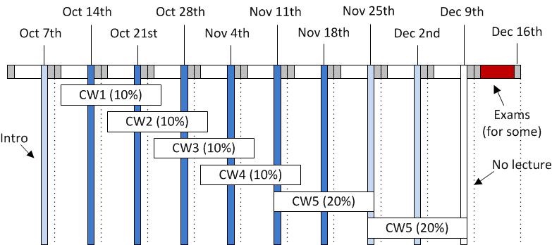

High Performance Computing For Engineers
========================================

Autum term 2016-2017

Please feel free to register issues on this repository if there is
information missing.

Coursework
----------

The course has seven points of assessment, with the timeline
shown below:

Links will be made available according to that timeline.

- [Coursework 1](https://github.com/HPCE/hpce-2016-cw1).

- [Coursework 2](https://github.com/HPCE/hpce-2016-cw2).

- [Coursework 3](https://github.com/HPCE/hpce-2016-cw3).

- [Coursework 4](https://github.com/HPCE/hpce-2016-cw4).

Lecture notes
-------------

The Panopto recordings are available to anyone who can access the panopto imperial site.

- [Lecture 0 : introduction](slides/hpce-lec0-introduction.pdf)

  - [Panopto Part 1](https://imperial.cloud.panopto.eu/Panopto/Pages/Viewer.aspx?id=ab2940cc-8ea3-4edf-b77b-7d5958ef1ee1) : I was
    using the laptop mic, so sound is variable as I walk around.

  - [Panopto Part 2](https://imperial.cloud.panopto.eu/Panopto/Pages/Viewer.aspx?id=33202873-1418-4715-8040-4b5cc79e96dc)
  
  - [Source code](slides/lec0)

- [Lecture 1 : TBB parallel_for](slides/hpce-lec1-parfor.pdf)
  
  - [Panopto](https://imperial.cloud.panopto.eu/Panopto/Pages/Viewer.aspx?id=46a42cd6-04c4-480f-881e-55c37126dc8b)

  - [Source code](slides/lec1)

- [Lecture 2 : TBB continued](slides/hpce-lec2-parfor-tbb.pdf)

  - [Panopto](https://imperial.cloud.panopto.eu/Panopto/Pages/Viewer.aspx?id=3eef6420-2cd8-466d-83f5-6e584b9a577d)
  
- [Lecture 3 : TBB internals](slides/hpce-lec3-tbb-details.pdf)

- [Lecture 4 : TBB OpenCL Intro](slides/hpce-lec4-opencl-intro.pdf)

